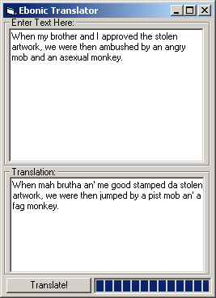



## Ebonic Translator

### Description

This translates english to...well ebonics. I just did it for fun cause I was bored, but it can translate like whole documents 'n stuff. Read at the screen shot.
 
### More Info
 

             |
---                |---
**Submitted On**   |2000-09-09 19:07:02
**By**             |[Jarem Archer](https://github.com/Planet-Source-Code/PSCIndex/blob/master/ByAuthor/jarem-archer.md)
**Level**          |Intermediate
**User Rating**    |4.8 (57 globes from 12 users)
**Compatibility**  |VB 5\.0, VB 6\.0
**Category**       |[Jokes/ Humor](https://github.com/Planet-Source-Code/PSCIndex/blob/master/ByCategory/jokes-humor__1-40.md)
**World**          |[Visual Basic](https://github.com/Planet-Source-Code/PSCIndex/blob/master/ByWorld/visual-basic.md)
**Archive File**   |[CODE\_UPLOAD9781992000\.zip](https://github.com/Planet-Source-Code/jarem-archer-ebonic-translator__1-11381/archive/master.zip)

